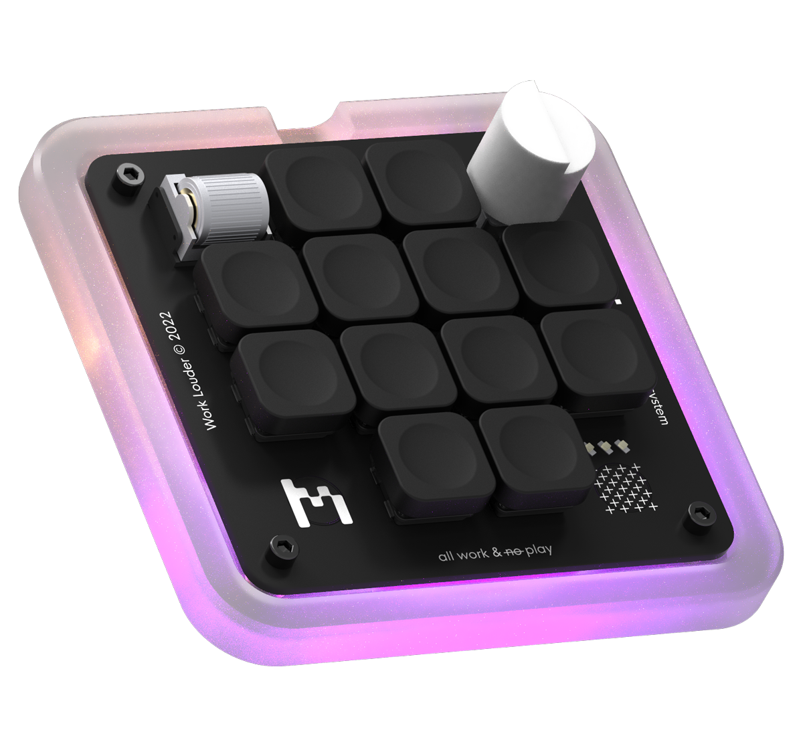

# AI Determinate WL Creator-Micro Configurator

Welcome to the AI Keyboard Configurator, a locally hosted solution to dynamically change the keymaps of your custom keyboard based on the active application.



## Table of Contents

- [Features](#features)
- [Prerequisites](#prerequisites)
- [Setup](#setup)
   - [Mac App Setup](#mac-app-setup)
   - [Web App Setup](#web-app-setup)
- [Usage](#usage)
- [License](#license)

## Features

- 🔌 Detect your custom keyboard model.
- 🔄 Quickly switch between keymaps based on active application.
- 🌐 Local web interface for easy configuration.
- 💡 LED level adjustment.

## Prerequisites

- Node.js & npm
- A Worklouder Creator Micro keyboard.
- Chrome or Edge browser (for WebHID API support to detect your keyboard).
- Mac with Vapor (for serving the list of open apps).

## Setup

### Mac App Setup

1. **Clone the Repository (if not done yet)**

    ```bash
    git clone https://github.com/your-username/keyboard-configurator.git
    cd keyboard-configurator/mac-app
    ```

2. **Install Vapor**

   If you haven't installed Vapor yet, follow the [official documentation](https://docs.vapor.codes/4.0/install/macos/) to set it up.

3. **Run the Mac App Server**

    ```bash
    swift run
    ```

   This will start serving the list of currently running apps on your Mac on `http://localhost:8080/runningApps`.

### Web App Setup

1. **Navigate to the Web App Directory**

   If you cloned the repository earlier, just navigate to the web-app directory:

    ```bash
    cd keyboard-configurator/web-app
    ```

2. **Install Dependencies**

    ```bash
    npm install
    ```

3. **Run the Web App Server**

    ```bash
    npm start
    ```

   This will start the web app on `http://localhost:3000/`.

## Usage

1. Ensure both the Mac App and Web App servers are running.
2. Connect your keyboard to your computer.
3. Open a browser and navigate to `http://localhost:3000/`.
4. Click on `Check if keyboard is connected` to confirm your keyboard model.
5. Configure your desired keymaps and settings using the provided UI.
6. The keymaps will dynamically adjust based on the active application you're using.
7. Enjoy a dynamic keyboard experience tailored to your active applications!

## License

This project is licensed under the MIT License - see the [LICENSE.md](LICENSE.md) file for details.

---

Made with 💙 by [Meals](https://github.com/emiliocramer)
