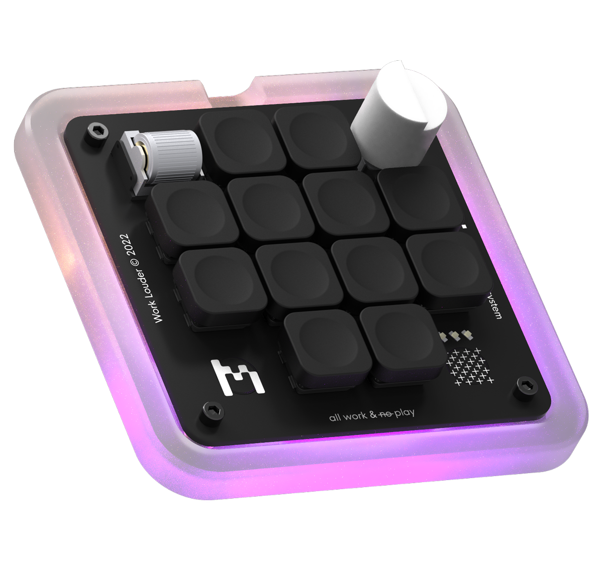

# AI Determinate WL Creator-Micro Configurator

Welcome to my AI Keyboard Configurator, a locally hosted solution to dynamically change the keymaps of your custom keyboard based on the active application.



## Table of Contents

- [Features](#features)
- [Prerequisites](#prerequisites)
- [Setup](#setup)
- [Usage](#usage)
- [Contribute](#contribute)
- [License](#license)

## Features

- 🔌 Detect your custom keyboard model.
- 🔄 Quickly switch between keymaps based on active application.
- 🌐 Local web interface for easy configuration.
- 💡 LED level adjustment.

## Prerequisites

- Node.js & npm
- A Worklouder Creator Micro keyboard.
- Chrome or Edge browser (due to WebHID API support of detecting your keyboard).

## Setup

1. **Clone the Repository**

    ```bash
    git clone https://github.com/your-username/keyboard-configurator.git
    cd keyboard-configurator
    ```

2. **Install Dependencies**

    ```bash
    npm install
    ```

3. **Run the Local Server**

    ```bash
    node index.js
    ```

## Usage

1. Connect your keyboard to your computer.
2. Open a browser and navigate to `http://localhost:3000/`.
3. Click on `Check if keyboard is connected` to confirm your keyboard model.
4. Configure your desired keymaps and settings using the provided UI.
5. Enjoy a dynamic keyboard experience tailored to your active applications!

## License

This project is licensed under the MIT License - see the [LICENSE.md](LICENSE.md) file for details.

---

Made with 💙 by [Meals](https://github.com/emiliocramer)
